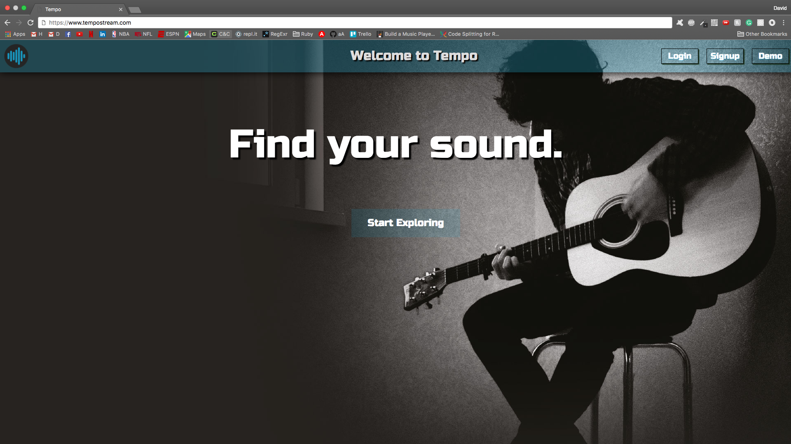
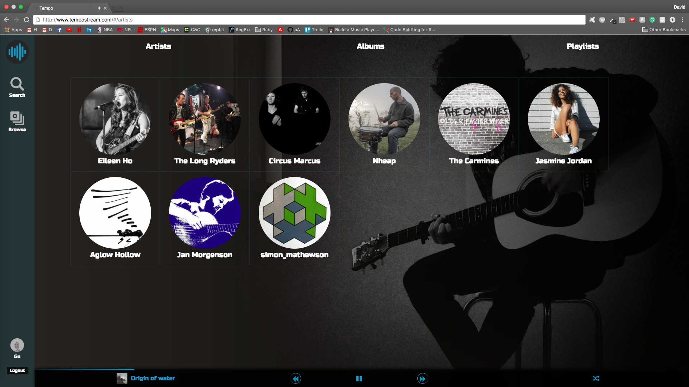

# Tempo

[Tempo](http://www.tempostream.com) is a web application that allows the users to stream music from their favorite artists. Inspired by [Spotify](https://www.spotify.com), Tempo allows user to browse different artists and albums. They can also create and follow different playlists.



## Features
- User account creation with secure authentication.
- Continuous music streaming while browsing.
- Search for artists, albums, songs, and playlists.
- Create playlists and add songs to playlist.
- Follow playlists created by other users.
- Add songs, albums, and playlists to queue.



## Design

A [development proposal](docs/development-readme.md) was drafted along with a [database schema](docs/schema.md).

Tempo features a sidebar for easy navigation, a main browse section for artists, albums, and playlists, and a music player that hides unless the user hovers over it.

## Technology

#### Backend Technology

Tempo is hosted on Heroku and uses Ruby on Rails to provide RESTful APIs and renders JSON data. PostgreSQL is the database used by Heroku.

#### Frontend Technology

Tempo is a single page application that uses React/Redux framework to render the HTML based on JSON data received from the backend.

**npm**

Node package manager is used to install of the necessary dependencies.
A post-install script is run to bundle the javascript files after deployment to Heroku.

```js
"postinstall": "./node_modules/.bin/webpack"
```

**webpack**
Webpack bundles all of the frontend components into a single file located in `app/assets/javascripts`.

**babel**
Babel is used to translate `.jsx` files into vanilla JavaScript.

**React/Redux**
All of the React components and Redux actions, API utilities, reducers, and store are located in the [frontend](frontend) folder.

**Other dependencies**
- React DOM
- React Router
- React Sound
- React/Redux
- Classnames

## Future Development

- Integrate React Router with Webpack to split up `bundle.js`.
- Create algorithm to recommend songs to user based on previous listens.
- Use server side rendering to allow for functional site if javascript is disabled.
- Add lyrics autoscrolling based on current song position.
